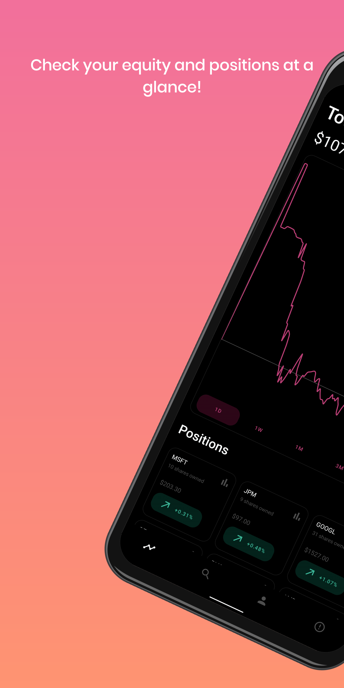
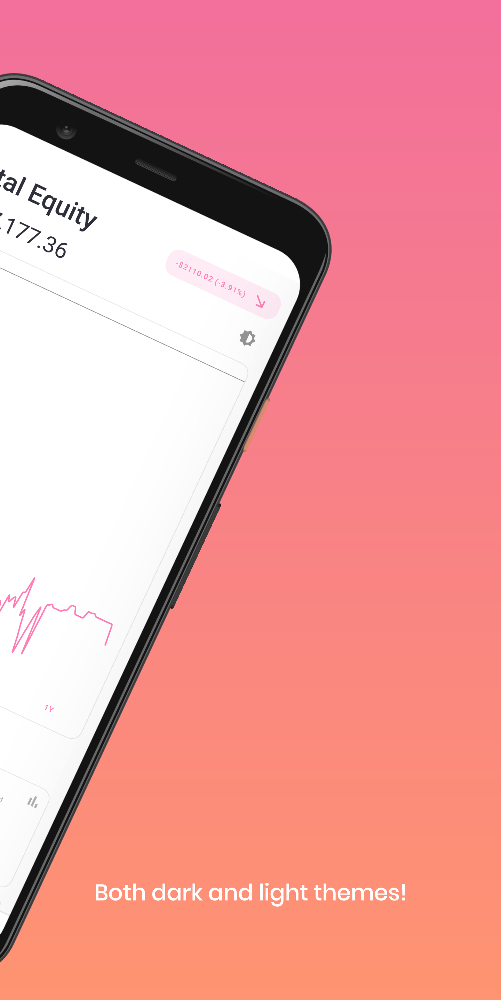
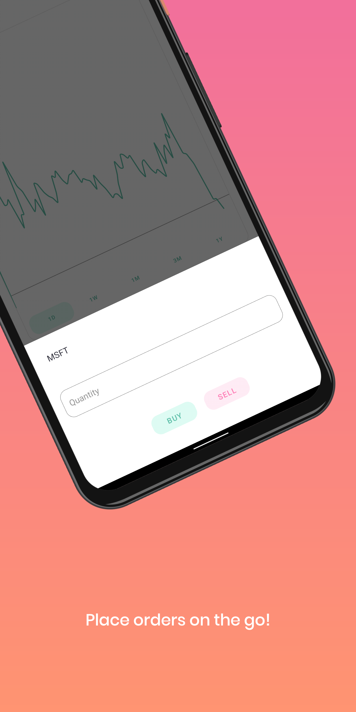
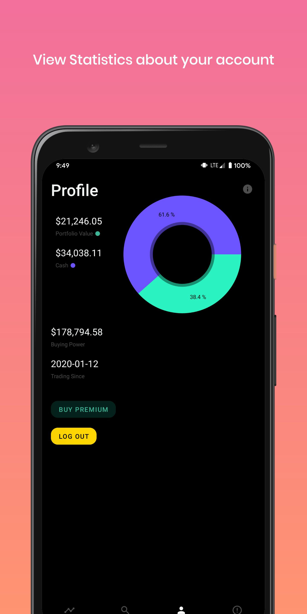
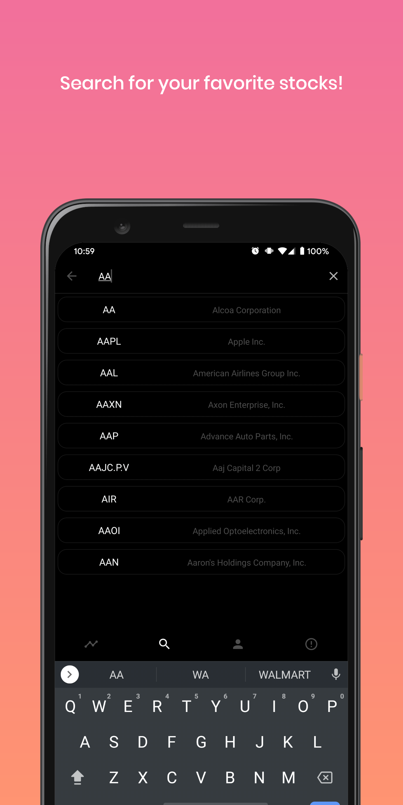
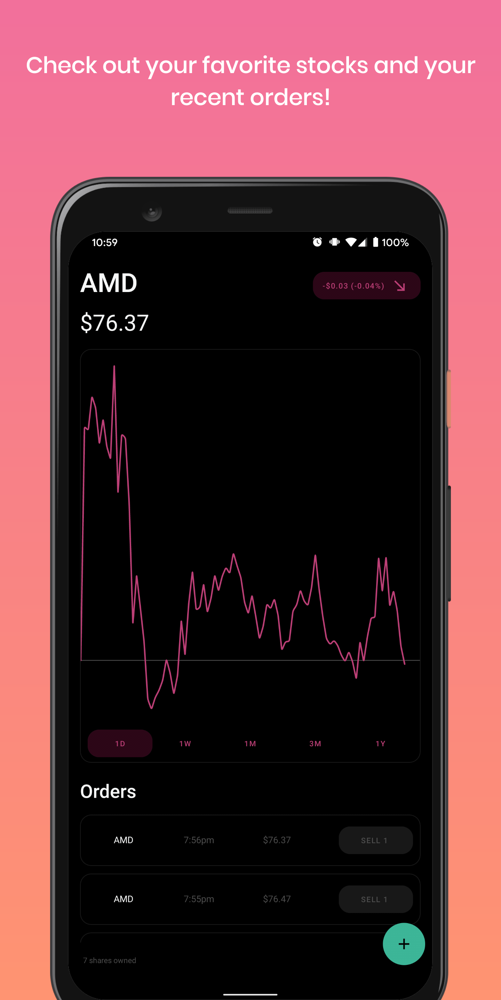

# Alpaca Dashboard

Free and open source dashboard for all of your trading needs on Alpaca. If you have a funded account and an eligible android phone give it a try and download it on Google Play!
[Download Now!](https://play.google.com/store/apps/details?id=com.seanmiller.alpacadashboard)

You may need to sign up as a tester for now, still looking to garner a few more testers so feel free to let me know what you think. [Join here!](https://play.google.com/apps/testing/com.seanmiller.alpacadashboard)

