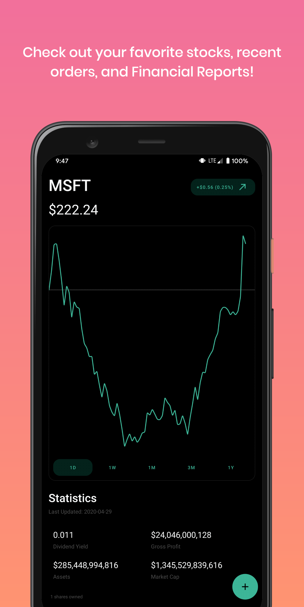
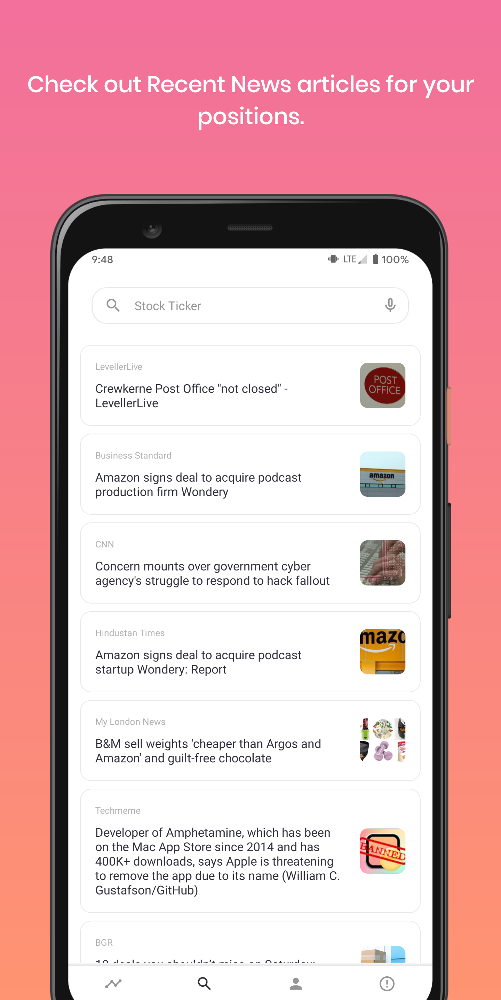

# Alpaca Dashboard

Free and open source dashboard for all of your trading needs on Alpaca. If you have a funded account and an eligible android phone give it a try and download it on Google Play!
[Download Now!](https://play.google.com/store/apps/details?id=com.seanmiller.alpacadashboard)

## Libraries Used

* [Alpaca Java Wrapper](https://github.com/Petersoj/alpaca-java)
* [Robinhood's Tickerview](https://github.com/robinhood/ticker)
* [Robinhood's Sparkline Graph](https://github.com/robinhood/spark)
* [Decorator for RecyclerViews](https://github.com/rubensousa/Decorator)
* [MPAndroid Chart PieChart](https://github.com/PhilJay/MPAndroidChart)
* [FAB Order Menu](https://github.com/Krupen/FabulousFilter)
* [Search Component](https://github.com/lapism/search)
* [AppAuth for OAuth](https://github.com/openid/AppAuth-Android)
* [News Article Viewer](https://github.com/klinker41/article-android)
* [Glide for Photos](https://github.com/bumptech/glide)

## Credits

Thanks to @Petersoj for creating the [Java wrapper for Alpaca](https://github.com/Petersoj/alpaca-java) and helping with OAuth integration

Thanks to @tommy_emo on Twitter for help with iconography
